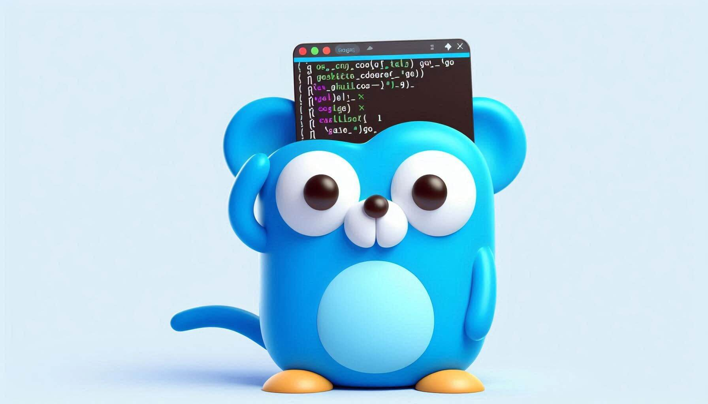

# username_r_gen



## A pseudo random username generator.

| Dictionary |                             Unique Count                             |
| :--------: | :------------------------------------------------------------------: |
| Adjectives |                                 325                                  |
|   Colors   |                                 148                                  |
|  Animals   |                                 535                                  |
|   Total    | 325 x 148 x 535 = 25,733,500 Possible combination (with out postfix) |

> [!NOTE]
> Using a type of Postfix like `UseProvidedNumber` or `UseProvidedNumberAfterOverflow` would paricaly make the conflicts nearly impossible

---

# How to use

```go
nameGenerator := usernaemgen.NewUsernameGen()
uniqueName := nameGenerator.Generate(1)
fmt.Println(uniqueName) // cute-blue-fox
```

> [!Tip]
> The algorithm is optimized for serialized number usage. So, if you have the user's ID, you should use it rather than an arbitrary number.
> For example, you can use the auto-generated ID from your database (`id AUTOINCREMENT/SERIAL PRIMARY KEY`)

### Or use the GenerateRand() fn

```go
nameGenerator := usernaemgen.NewUsernameGen()
uniqueName := nameGenerator.GenerateRand()
fmt.Println(uniqueName) // nervous-Gold-hornbill-551536555
```

### You can customize the dictionaries, delimiter, and postfixType

```go
nameGenerator := usernaemgen.NewUsernameGenWithOptions(
	"__",
	usernaemgen.NoPostfix,
	usernaemgen.Adjectives,
	usernaemgen.Animals,
)
uniqueName := nameGenerator.GenerateRand()
fmt.Println(uniqueName) // great__canary
```

### You can change the order of the dictionaries

```go
nameGenerator := usernaemgen.NewUsernameGenWithOptions(
	"-",
	usernaemgen.NoPostfix,
	usernaemgen.Animals, // <-- will start from animals rather then adjectives liken in the previous examples
	usernaemgen.Colors, // <-- then colors
	usernaemgen.Adjectives, // <-- and finish with the adjectives
)
uniqueName := nameGenerator.GenerateRand()
fmt.Println(uniqueName) // cat-blue-angry
```
